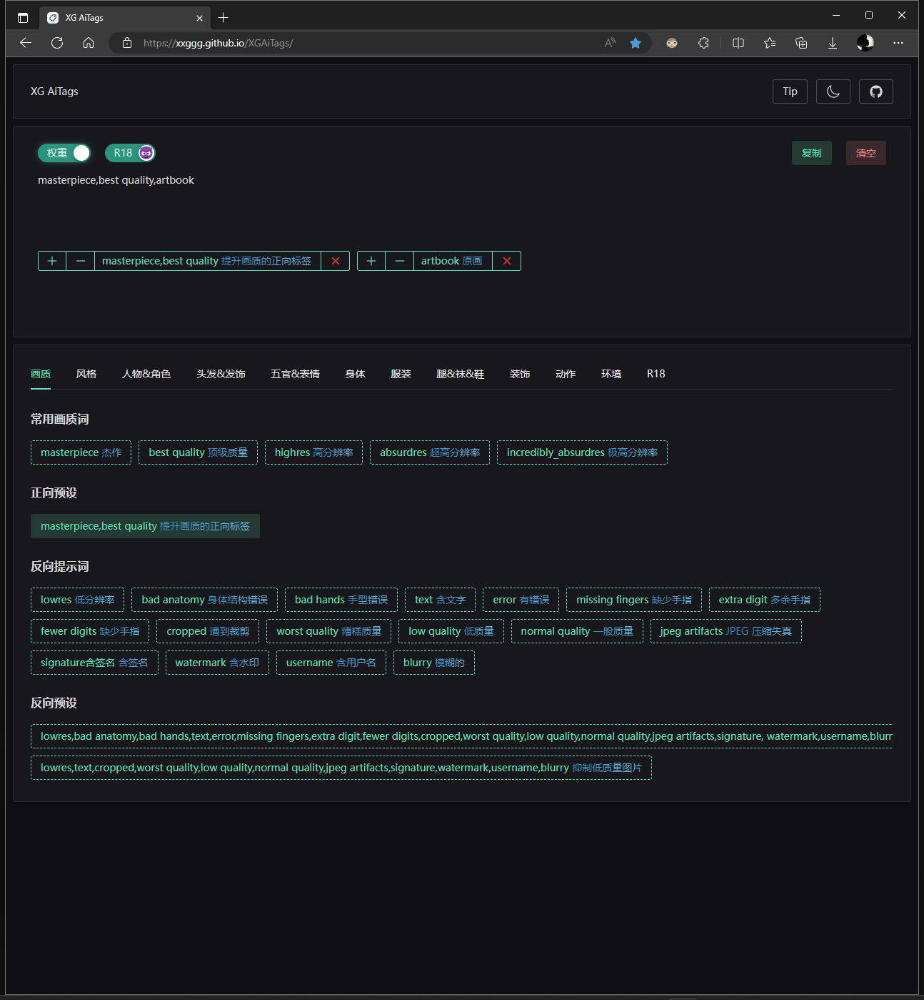

<h1 align="center">
🏷️ XGAiTags 🏷️
</h1>

Tools to write Tags.

写 关键词 - Tags 用的小工具

<a href="https://xxggg.github.io/XGAiTags/"><b>Web</b></a> 
|
<a href="https://github.com/XXGGG/XGAiTags"><b>Github</b></a>

<!-- 

 <a href="">Chrome</a> | <a href="">Edge</a> | <a href="">QQ浏览器</a> | <a href="">360浏览器</a>

 -->

## 📖 介绍

1. 这是一个用来给 Stable Diffusion 写关键词用的小工具
2. 只需要在网页下面选择对应的关键词就可以汇总到上方的框框中，可以选择复制或清空。
3. 可以对关键词以Stable Diffusion的权重规则添加或减少权重比！-> ` “()” ` 和 ` “[]” `。

## 🖼️ 展示

  

## 🚀 记录

### 技术栈 👇

1. Vite3 + Vue3 + TypeScript
2. [NaiveUI](https://www.naiveui.com/zh-CN/os-theme)
